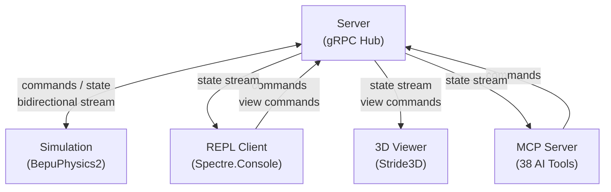
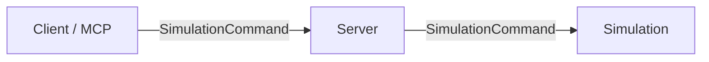
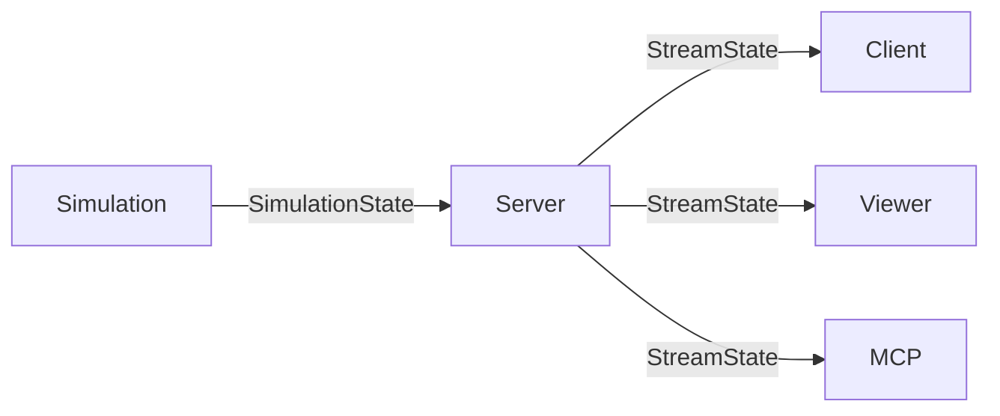
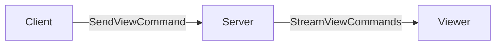

# Physics Sandbox — Aspire Microservices Demo

## Architecture

Five services, all communication routed through the Server.



## Services

| Service | Role | Tech |
|---------|------|------|
| **Server** | Central hub. Routes all messages between services. | ASP.NET gRPC server |
| **Simulation** | Runs physics simulation. Receives commands, emits state. | F# + BepuPhysics2, gRPC bidirectional stream |
| **Client** | REPL for user input. Sends commands and camera/UI settings. | F# + Spectre.Console, gRPC client |
| **Viewer** | 3D rendering of simulation state. Receives state + camera. | F# + Stride3D, gRPC client |
| **MCP** | AI assistant integration. 38 tools for simulation control. | F# + ModelContextProtocol, gRPC client |

## Communication Flows

### 1. Commands: Client → Server → Simulation



User types commands in the REPL (add body, apply force, set gravity, step,
play, pause). Client sends them to Server via `SendCommand` / `SendBatchCommand`.
Server forwards to Simulation via the `ConnectSimulation` bidirectional stream.

### 2. Simulation Data: Simulation → Server → Client + Viewer



Simulation streams world state (body positions, velocities, timing) to
Server via the `ConnectSimulation` upstream. Server caches the latest state
(for late joiners) and fans out to all `StreamState` subscribers.

### 3. View Commands: Client → Server → Viewer



User sets camera position, zoom, toggle wireframe. Client sends to
Server via `SendViewCommand`, Server forwards to Viewer via `StreamViewCommands`.

## Contracts (Platform.Shared.Contracts)

```protobuf
service PhysicsHub {
  // Client → Server → Simulation
  rpc SendCommand (SimulationCommand) returns (CommandAck);

  // Client → Server → Viewer
  rpc SendViewCommand (ViewCommand) returns (CommandAck);

  // Server → Client/Viewer (streaming)
  rpc StreamState (StateRequest) returns (stream SimulationState);
}

message SimulationCommand {
  oneof command {
    AddBody add_body = 1;
    ApplyForce apply_force = 2;
    SetGravity set_gravity = 3;
    StepSimulation step = 4;
    PlayPause play_pause = 5;
  }
}

message ViewCommand {
  oneof command {
    SetCamera set_camera = 1;
    ToggleWireframe toggle_wireframe = 2;
    SetZoom set_zoom = 3;
  }
}

message SimulationState {
  repeated Body bodies = 1;
  double time = 2;
  bool running = 3;
}

message Body {
  string id = 1;
  Vec3 position = 2;
  Vec3 velocity = 3;
  double mass = 4;
  Shape shape = 5;
}
```

## Aspire AppHost

```csharp
var builder = DistributedApplication.CreateBuilder(args);

var server = builder.AddProject<Projects.PhysicsServer>("server");

builder.AddProject<Projects.PhysicsSimulation>("simulation")
    .WithReference(server)
    .WaitFor(server);

builder.AddProject<Projects.PhysicsViewer>("viewer")
    .WithReference(server)
    .WaitFor(server);

builder.AddProject<Projects.PhysicsClient>("client")
    .WithReference(server)
    .WaitFor(server);

builder.Build().Run();
```

Server starts first. Simulation, Viewer, and Client wait for Server to be
healthy, then connect via service discovery (`https+http://server`).

## Spec-Kit Workflow

Each service is a feature spec, built one at a time:

1. **Spec 001:** Contracts + Server (the hub must exist first)
2. **Spec 002:** Simulation (physics engine + gRPC integration)
3. **Spec 003:** Client (REPL + command sending + state display)
4. **Spec 004:** Viewer (3D rendering + state/camera streaming)

Each spec starts a fresh branch, fresh context. The constitution
(`fsMicroservices`) governs all four.
