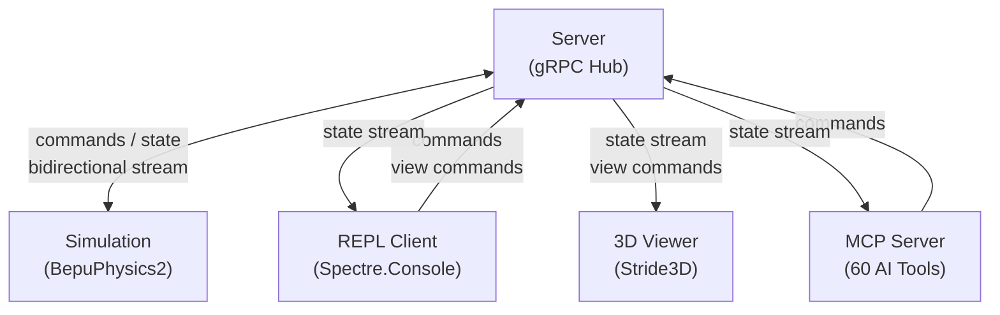

> **Note:** This project uses [Spec Kit](https://github.com/github/spec-kit) for specification-driven development.
> Development is guided by a project constitution — see [.specify/memory/constitution.md](.specify/memory/constitution.md) for the
> governing principles and architectural constraints.

# Physics Sandbox

A real-time 3D physics simulation built as an F# microservices architecture on .NET 10, orchestrated by [.NET Aspire](https://learn.microsoft.com/dotnet/aspire/) 13.2. Drop bodies, apply forces, flip gravity, and watch the results in a live [Stride3D](https://www.stride3d.net/) viewer — controlled through a REPL client, F#/Python scripts, or AI assistants via [MCP](https://modelcontextprotocol.io/). Physics powered by [BepuPhysics2](https://github.com/bepu/bepuphysics2) via [BepuFSharp](https://github.com/EHotwagner/BepuFSharp) 0.3.0.

## Architecture

Five F# services communicate through a central gRPC hub:



| Service | Role |
|---|---|
| **PhysicsServer** | Central gRPC hub — routes commands, fans out state, tracks metrics |
| **PhysicsSimulation** | BepuPhysics2 engine — steps the world, streams state |
| **PhysicsViewer** | Stride3D renderer — visualizes bodies, applies camera commands |
| **PhysicsClient** | REPL console — sends commands, displays state with Spectre.Console |
| **PhysicsSandbox.Mcp** | MCP server — 60 tools for AI-assisted simulation control, recording & replay |

## Key Technologies

- [.NET Aspire 13.2](https://learn.microsoft.com/dotnet/aspire/) — service orchestration and telemetry
- [BepuPhysics2](https://github.com/bepu/bepuphysics2) via [BepuFSharp 0.3.0](https://github.com/EHotwagner/BepuFSharp) — high-performance rigid body physics engine
- [Stride3D](https://www.stride3d.net/) — open-source C# game engine for 3D visualization
- [MCP](https://modelcontextprotocol.io/) — Model Context Protocol for AI assistant integration
- [Spectre.Console](https://spectreconsole.net/) — rich terminal UI for the REPL client

## Quick Start

### Option A: Container (Quickest)

No local .NET SDK or system packages needed — just a GPU and an X11 display:

```bash
# Build from source (clones repos inside the container)
podman build -t physicssandbox .

# Allow X11 access from the container
xhost +local:

# Run
podman run --rm -it \
  --device /dev/dri \
  --network host \
  -e DISPLAY=$DISPLAY \
  -v /tmp/.X11-unix:/tmp/.X11-unix \
  physicssandbox
```

For NVIDIA GPUs, replace `--device /dev/dri` with `--device nvidia.com/gpu=all`.

MCP is available at `http://localhost:5199/sse`.

### Option B: Build from Source

#### Prerequisites

- [.NET 10.0 SDK](https://dotnet.microsoft.com/download)
- GPU with OpenGL support (for the 3D viewer)
- Linux packages: `openal`, `freetype2`, `sdl2`, `ttf-liberation`, `freeimage`
- FreeImage symlink: `ln -sf /usr/lib/libfreeimage.so /usr/lib/freeimage.so`

#### Build & Run

```bash
# Build
dotnet build PhysicsSandbox.slnx

# Run (starts all services + Aspire dashboard)
./start.sh          # HTTP profile (default, required for MCP with Claude Code)
./start.sh --https  # HTTPS profile

# Or run directly
dotnet run --project src/PhysicsSandbox.AppHost
```

The Aspire dashboard opens at `http://localhost:8081`.

### Interact

There are four ways to interact with the running simulation. All require the AppHost to be running first (via `./start.sh` or `dotnet run --project src/PhysicsSandbox.AppHost`).

**REPL Client** — The PhysicsClient project is a library of modules (`Session`, `SimulationCommands`, `ViewCommands`, `Presets`, etc.) used by the demo scripts and MCP server. The AppHost registers it as an Aspire resource for dashboard visibility, but the launched process itself is not interactive. To get an interactive F# session, open a separate terminal and load the REPL script:

```bash
dotnet fsi src/PhysicsClient/PhysicsClient.fsx
```

This drops you into F# Interactive with all client modules loaded. Connect to the server and start sending commands:

```fsharp
let s = Session.connect "http://localhost:5180" |> Result.defaultWith failwith
SimulationCommands.play s        // start the simulation
SimulationCommands.pause s       // pause it
Presets.marble s None None None   // drop a marble
ViewCommands.smoothCamera s (10.0, 8.0, 10.0) (0.0, 2.0, 0.0) 2.0  // move camera
```

**F# Scripts** — 24 demos in `Scripting/demos/`:
```bash
dotnet fsi Scripting/demos/Demo01_HelloDrop.fsx    # single demo
dotnet fsi Scripting/demos/AutoRun.fsx             # run all demos sequentially
```

Each script connects to the server automatically (defaults to `http://localhost:5180`, pass a different address as the first argument).

**Python Scripts** — 21 demos in `Scripting/demos_py/` (requires generated gRPC stubs):
```bash
pip install -r Scripting/demos_py/requirements.txt
python -m Scripting.demos_py.demo01_hello_drop           # single demo
python -m Scripting.demos_py.auto_run                    # run all demos
```

**MCP (AI Assistants)** — 60 tools for Claude Code, etc. The MCP server starts automatically with the AppHost on `http://localhost:5199/sse`. To use it with Claude Code, start the AppHost first, then launch Claude:

```bash
./start.sh && MCP_TIMEOUT=10000 claude
```

For standalone use outside Aspire, run the MCP server directly:
```bash
dotnet run --project src/PhysicsSandbox.Mcp
```

## Documentation

Full documentation is available at **https://EHotwagner.github.io/PhysicsSandbox/**

To build and preview locally:
```bash
dotnet tool restore
dotnet fsdocs watch
```
Then open http://localhost:8901.

### Documentation Contents

- [Getting Started](https://EHotwagner.github.io/PhysicsSandbox/getting-started.html) — build, run, and interact (includes container option)
- [Architecture](https://EHotwagner.github.io/PhysicsSandbox/architecture.html) — service design and gRPC contracts
- [Demo Scripts](https://EHotwagner.github.io/PhysicsSandbox/demo-scripts.html) — 24 F# and 21 Python physics demos
- [MCP Tools](https://EHotwagner.github.io/PhysicsSandbox/mcp-tools.html) — 60 tools for AI-assisted control
- [Test Suite](https://EHotwagner.github.io/PhysicsSandbox/tests.html) — 467 tests across 7 projects
- [Release: Stride BepuPhysics Integration](https://EHotwagner.github.io/PhysicsSandbox/release-005.html) — what's new in the latest release
- [Known Issues](https://EHotwagner.github.io/PhysicsSandbox/known-issues.html) — limitations and workarounds

## Features

- **Real-time physics** — BepuPhysics2 simulation with 10 shape types (sphere, box, plane, capsule, cylinder, triangle, convex hull, compound, mesh, shape reference)
- **10 constraint types** — hinge, ball-socket, weld, distance, swing/twist limits, motors, point-on-line
- **Accurate shape rendering** — all 10 shape types render with collision-matching geometry (including triangle, mesh, convex hull, compound)
- **Per-body color** — RGBA color per body with auto-assigned shape-type defaults
- **Material properties** — friction, bounciness, damping per body with presets
- **Physics queries** — raycast, sweep cast, overlap with batch variants via dedicated RPCs
- **Collision layers** — 32-bit group/mask filtering for physics and queries
- **Kinematic bodies** — script-driven motion, unaffected by gravity
- **Debug visualization** — wireframe collider outlines and constraint connections (F3 toggle)
- **3D visualization** — Stride3D renderer with smooth camera control and demo narration overlay
- **MCP recording & replay** — record simulation sessions, query snapshots, trajectories, and events
- **gRPC communication** — contract-first design with proto files
- **Aspire orchestration** — service discovery, health checks, telemetry dashboard
- **MCP integration** — 60 tools for AI assistants (simulation, queries, recording, stress tests)
- **Dual scripting** — 24 F# demos and 21 Python demos
- **467 tests** — unit tests (xUnit) + Aspire integration tests across 7 projects
- **Container support** — single Containerfile for Podman/Docker deployment

## Testing

```bash
dotnet test PhysicsSandbox.slnx -p:StrideCompilerSkipBuild=true
```

| Project | Tests | Type |
|---|---|---|
| PhysicsSimulation.Tests | 114 | Unit |
| PhysicsViewer.Tests | 99 | Unit |
| PhysicsClient.Tests | 78 | Unit |
| PhysicsServer.Tests | 48 | Unit |
| PhysicsSandbox.Scripting.Tests | 26 | Unit |
| PhysicsSandbox.Mcp.Tests | 18 | Unit |
| PhysicsSandbox.Integration.Tests | 84 | Integration (Aspire) |

## Project Structure

```
PhysicsSandbox.slnx
Containerfile                       # Podman/Docker container build
src/
  PhysicsSandbox.AppHost/           # C# Aspire orchestrator
  PhysicsSandbox.ServiceDefaults/   # C# shared health/telemetry
  PhysicsSandbox.Shared.Contracts/  # Proto gRPC contracts
  PhysicsServer/                    # F# server hub (message router)
  PhysicsSimulation/                # F# physics simulation (BepuFSharp 0.3.0)
    Queries/                        #   QueryHandler (raycast, sweep, overlap)
  PhysicsViewer/                    # F# 3D viewer (Stride3D)
    Rendering/ShapeGeometry         #   procedural mesh generation (all 10 types)
    Rendering/DebugRenderer         #   wireframe collider + constraint visualization
  PhysicsClient/                    # F# REPL client (Spectre.Console)
  PhysicsSandbox.Mcp/               # F# MCP server (60 tools, recording & query)
    Recording/                      #   append-only protobuf recording engine
  PhysicsSandbox.Scripting/         # F# scripting library (6 modules)
    ConstraintBuilders              #   constraint creation helpers
    QueryBuilders                   #   physics query helpers
tests/
  PhysicsServer.Tests/              # 48 unit tests
  PhysicsSimulation.Tests/          # 114 unit tests
  PhysicsViewer.Tests/              # 99 unit tests
  PhysicsClient.Tests/              # 78 unit tests
  PhysicsSandbox.Mcp.Tests/         # 18 unit tests
  PhysicsSandbox.Scripting.Tests/   # 26 unit tests
  PhysicsSandbox.Integration.Tests/ # 84 integration tests
Scripting/
  demos/                            # F# demo scripts (24 demos + runners)
  demos_py/                         # Python demo scripts (21 demos + runners)
  scripts/                          # Curated F# scripts (Scripting library)
  scratch/                          # Experimentation (gitignored)
```

## Known Issues

- **Box-box collision detection** — Occasional incorrect collision detection between box shapes. Under investigation.

See [Known Issues](https://EHotwagner.github.io/PhysicsSandbox/known-issues.html) for the full list of limitations and workarounds.

## License

This project is licensed under the MIT License — see [LICENSE](LICENSE) for details.
